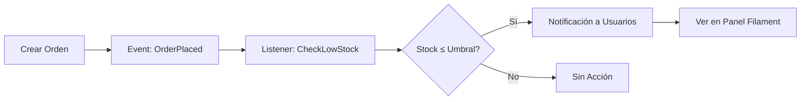

# 🍽️ Servi2 - Sistema TPV e Inventario para HORECA

> Sistema de Punto de Venta (TPV) y gestión de inventario para el sector HORECA desarrollado con Laravel 11 y Filament v5.

[](https://laravel.com)
[](https://filamentphp.com)
[](https://php.net)
[](https://postgresql.org)
[]()

---

## 📋 Descripción

**Servi2** es una aplicación web moderna y completa para la gestión de restaurantes, bares y cafeterías. Combina un potente sistema de punto de venta (TPV) con gestión avanzada de inventario, control de usuarios con roles, y notificaciones automáticas en tiempo real.

### ✨ ¿Por qué Servi2?

- ✅ **Sistema completo y listo para producción**
- ✅ **Interfaz moderna construida con Filament v5**
- ✅ **141 tests automatizados** garantizan estabilidad
- ✅ **Notificaciones en tiempo real** de stock bajo
- ✅ **Control de roles y permisos** (Admin/Camarero)
- ✅ **Trazabilidad completa** de movimientos de stock
- ✅ **Arquitectura event-driven** escalable
- ✅ **Docker** para despliegue fácil

---

## 🚀 Características Principales

<details>
<summary><b>📱 Sistema TPV (Punto de Venta)</b></summary>

- **Gestión de Mesas**: Control completo de mesas de restaurante (interior/terraza) con capacidad
- **Órdenes/Comandas**: Sistema completo de pedidos con ítems, estados y trazabilidad
- **Notificaciones en Tiempo Real**: Alertas automáticas de stock bajo integradas con Filament
- **Historial Completo**: Trazabilidad de todos los pedidos por usuario y mesa
- **Control de Estados**: Pending, Completed, Cancelled

</details>

<details>
<summary><b>📦 Gestión de Inventario Inteligente</b></summary>

- **Productos con UUID v7**: CRUD completo con soft deletes, códigos de barras y SKU únicos
- **Categorías Personalizables**: Organización con colores hex (Bebidas, Cafés, Entrantes, Platos, Postres)
- **Proveedores**: Gestión completa de información y productos asociados
- **Movimientos de Stock**: Trazabilidad total (compras, ventas, ajustes, mermas)
- **Control Opcional**: Ideal para servicios que no requieren tracking de inventario

</details>

<details>
<summary><b>🔔 Sistema de Alertas Automáticas</b></summary>

- **Listener CheckLowStock**: Notificaciones cuando el stock está bajo el umbral
- **Notificaciones Filament**: Integradas en el panel de administración
- **Acciones Directas**: Botones para ir directamente al producto desde la notificación
- **Configuración por Producto**: Umbral personalizable para cada producto

</details>

<details>
<summary><b>🔐 Control de Acceso y Roles</b></summary>

- **Sistema ACL Completo**: Gestión de usuarios con roles (Admin/Camarero)
- **Permisos Granulares**: Solo administradores acceden al panel de gestión
- **Perfil de Usuario**: Cada usuario puede editar su perfil y avatar
- **Trazabilidad**: Registro de quién realiza cada acción

</details>

<details>
<summary><b>🎨 Panel Administrativo Filament v5</b></summary>

- **Interfaz Moderna**: UI responsive y atractiva
- **Notificaciones Database**: Sistema de notificaciones persistentes
- **Formularios Dinámicos**: Validaciones en tiempo real
- **Tablas Avanzadas**: Filtros, búsqueda, ordenamiento y exportación
- **Relation Managers**: Visualización de relaciones entre modelos
- **Acciones Personalizadas**: Modal de ajuste de stock, acciones masivas

</details>

## 🛠️ Stack Tecnológico

- **Backend**: Laravel 11 (PHP 8.3)
- **Admin Panel**: Filament v5
- **Base de Datos**: PostgreSQL
- **Frontend**: Livewire 3, Alpine.js, Tailwind CSS
- **Containerización**: Docker + Docker Compose
- **Testing**: PHPUnit (141 tests, 265 aserciones)
- **Arquitectura**: Event-Driven (Events & Listeners)

## 📦 Requisitos Previos

- Docker Engine 20.10 o superior
- Docker Compose v2.0 o superior
- Git

---

## 🔧 Instalación y Configuración

### Requisitos Previos

- Docker Engine 20.10+
- Docker Compose v2.0+
- Git

### ⚡ Instalación en 5 Pasos

```bash
# 1️⃣ Clonar el repositorio
git clone https://github.com/tu-usuario/Servi2.git
cd Servi2

# 2️⃣ Levantar los contenedores
docker compose up -d

# 3️⃣ Instalar dependencias
docker compose exec web composer install
docker compose exec web npm install && npm run build

# 4️⃣ Configurar entorno
docker compose exec web cp .env.example .env
docker compose exec web php artisan key:generate
docker compose exec web php artisan storage:link

# 5️⃣ Base de datos y datos de prueba
docker compose exec web php artisan migrate:fresh --seed
```

### 🎉 ¡Listo! Accede al sistema

- 🌐 **URL**: http://localhost
- 👤 **Usuario**: admin@admin.com
- 🔑 **Contraseña**: password

> 💡 **Tip**: Para ver todos los comandos Docker disponibles, consulta la [Guía Docker](#-guía-del-entorno-de-desarrollo-docker)

---

## 📊 Datos de Prueba

El sistema incluye **seeders realistas** que crean automáticamente:

| Entidad | Cantidad | Detalles |
|---------|----------|----------|
| 👤 **Usuarios** | 4 | 1 Admin + 3 Camareros (Carlos, María, Juan) |
| 🪑 **Mesas** | 10 | 5 interiores + 5 terraza (capacidad 2-6 personas) |
| 🏷️ **Categorías** | 5 | Bebidas, Cafés, Entrantes, Platos, Postres (con colores) |
| 📦 **Productos** | 20 | Variedad completa con precios, stock, SKU |
| 🚚 **Proveedores** | 3 | Distribuciones Bebidas, Carnicería Selecta, Productos Gourmet |

<details>
<summary><b>Ver categorías con colores</b></summary>

- 🔵 **Bebidas** `#3B82F6` - Coca-Cola, Agua, Cerveza, Vino
- 🟤 **Cafés** `#92400E` - Café Solo, Café con Leche, Cappuccino
- 🟢 **Entrantes** `#10B981` - Ensalada, Croquetas, Patatas Bravas
- 🔴 **Platos Principales** `#EF4444` - Entrecot, Pollo, Paella, Merluza
- 🟠 **Postres** `#F59E0B` - Tarta de Queso, Flan, Helado, Tiramisú

</details>

<details>
<summary><b>Ver productos con stock bajo (para testing)</b></summary>

Estos productos están configurados con stock bajo el umbral para probar el sistema de notificaciones:

- ⚠️ **Cerveza Estrella Galicia**: Stock 8 / Mínimo 15
- ⚠️ **Patatas Bravas**: Stock 3 / Mínimo 5
- ⚠️ **Paella Valenciana**: Stock 5 / Mínimo 5
- ⚠️ **Helado (3 bolas)**: Stock 2 / Mínimo 5

</details>

> 📄 **Más información**: [IMPLEMENTACION_TPV.md](IMPLEMENTACION_TPV.md)

---

## 🔔 Sistema de Notificaciones de Stock Bajo

Sistema inteligente de alertas automáticas integrado con Filament.

### ⚙️ ¿Cómo Funciona?



1. Al crear una orden → Se dispara evento `OrderPlaced`
2. El listener `CheckLowStock` verifica cada producto
3. Si `stock_quantity` ≤ `low_stock_threshold` y `track_stock` = true
4. Envía notificación de Filament a todos los usuarios

### 📬 Características de las Notificaciones

- **Tipo**: Warning ⚠️
- **Título**: "Stock Bajo: [Nombre Producto]"
- **Mensaje**: "Quedan X unidades. Stock de seguridad: Y"
- **Acción**: Botón "Ver Producto" → Redirige a edición del producto
- **Destinatarios**: Todos los usuarios del sistema

### 🧪 Probar las Notificaciones

```bash
# Desde tinker de Laravel
docker compose exec web php artisan tinker

# Ejecutar script de prueba incluido
include 'development/test_low_stock_listener.php';
```

> 📄 **Documentación completa**: [IMPLEMENTACION_TPV.md](IMPLEMENTACION_TPV.md)

---

## 🧪 Testing

El proyecto cuenta con **141 tests automatizados** (265 aserciones) que garantizan la estabilidad del código.

### 🚀 Ejecutar Tests

```bash
# Todos los tests
docker compose exec web php artisan test

# Tests por modelo
docker compose exec web php artisan test tests/Feature/ProductTest.php
docker compose exec web php artisan test tests/Unit/ProductUnitTest.php

# Con cobertura
docker compose exec web php artisan test --coverage
```

### 📊 Cobertura de Tests

| Modelo | Feature | Unit | Total | Aserciones |
|--------|---------|------|-------|-----------|
| 📦 **Product** | 22 | 21 | **43** | ~80 |
| 📊 **StockMovement** | 20 | 19 | **39** | ~72 |
| 🏷️ **Category** | 13 | 11 | **24** | ~45 |
| 🚚 **Supplier** | 17 | 17 | **34** | ~68 |
| **TOTAL** | **72** | **68** | **141** | **265** |

> 💡 Todos los tests están pasando ✅

---

## 📁 Estructura del Proyecto

```
Servi2/
├── development/                    # Código fuente Laravel
│   ├── app/
│   │   ├── Events/
│   │   │   └── OrderPlaced.php
│   │   ├── Listeners/
│   │   │   └── CheckLowStock.php
│   │   ├── Filament/
│   │   │   └── Resources/
│   │   │       └── Products/
│   │   ├── Models/
│   │   │   ├── Category.php
│   │   │   ├── Product.php
│   │   │   ├── StockMovement.php
│   │   │   ├── Supplier.php
│   │   │   ├── Order.php
│   │   │   ├── OrderItem.php
│   │   │   └── RestaurantTable.php
│   │   └── Providers/
│   ├── database/
│   │   ├── factories/              # 6 factories con estados
│   │   ├── migrations/             # 6 migraciones
│   │   └── seeders/                # 6 seeders realistas
│   ├── tests/
│   │   ├── Feature/                # 72 tests de integración
│   │   └── Unit/                   # 68 tests unitarios
│   └── test_low_stock_listener.php # Script de prueba
├── web/                            # Configuración Docker
│   ├── Dockerfile
│   └── entrypoint.sh
├── docker-compose.yml
├── IMPLEMENTACION_TPV.md           # Documentación técnica completa
└── README.md
```

## 🗄️ Modelos del Sistema

### RestaurantTable
- Gestión de mesas del restaurante
- Control de disponibilidad (`is_available`)
- Capacidad de comensales
- Relación: `hasMany(Order)`

### Order
- Pedidos/Comandas del restaurante
- Estados: `pending`, `completed`, `cancelled`
- Relación con mesa y usuario (camarero)
- **Precios en céntimos** (enteros para evitar redondeo)
- Relación: `hasMany(OrderItem)`

### OrderItem
- Ítems individuales de cada pedido
- Precio histórico (momento de la venta)
- Cantidad, subtotal, IVA
- Relaciones: `belongsTo(Order)`, `belongsTo(Product)`

### Product
- UUID v7 como clave primaria
- Soft deletes
- Barcode y SKU únicos
- Scopes: `active()`, `lowStock()`
- Accessors: formateo de precios, cálculo de IVA
- `track_stock`: Control opcional de inventario
- Relaciones: `belongsTo(Category)`, `belongsTo(Supplier)`, `hasMany(StockMovement)`

### Category
- Soft deletes
- Slug único para URLs
- Color hex personalizado
- Scope: `active()`
- Relación: `hasMany(Product)`

### Supplier
- Información de proveedores
- Campos opcionales de contacto
- Relación: `hasMany(Product)`

### StockMovement
- Trazabilidad de movimientos de inventario
- Tipos: `purchase`, `sale`, `adjustment`, `waste`
- Scopes: `byType()`, `forProduct()`
- Relaciones: `belongsTo(Product)`, `belongsTo(User)`

## 🔑 Factories y Estados

Cada modelo incluye factories con estados personalizados:

- **CategoryFactory**: `active()`, `inactive()`
- **ProductFactory**: `active()`, `inactive()`, `outOfStock()`, `lowStock()`
- **StockMovementFactory**: `purchase()`, `sale()`, `adjustment()`, `waste()`
- **SupplierFactory**: Datos realistas de proveedores

## 💰 Importante: Precios en Céntimos

**TODOS los precios se almacenan como enteros (céntimos)** para evitar errores de redondeo:

```php
// Guardar en DB
$cost_price = 250;     // 2.50€
$sale_price = 1500;    // 15.00€
$tax_rate = 1000;      // 10.00%

// Mostrar al usuario
$precioEuros = $cost_price / 100;  // 2.50
```

## 🎯 Uso del Sistema

### Crear una Orden con Notificación de Stock Bajo
```php
use App\Models\Order;
use App\Models\OrderItem;
use App\Models\Product;
use App\Events\OrderPlaced;

// 1. Obtener producto con stock bajo
$cerveza = Product::where('sku', 'BEB-003')->first();

// 2. Crear orden
$order = Order::create([
    'user_id' => auth()->id(),
    'status' => 'pending',
    'total' => 0,
]);

// 3. Agregar ítem
OrderItem::create([
    'order_id' => $order->id,
    'product_id' => $cerveza->id,
    'quantity' => 2,
    'unit_price' => $cerveza->sale_price,
    'tax_rate' => $cerveza->tax_rate,
    'subtotal' => $cerveza->sale_price * 2,
]);

// 4. Disparar evento (automático en producción)
event(new OrderPlaced($order));

// 5. ✅ Todos los usuarios recibirán notificación si stock_quantity <= low_stock_threshold
```

## 🐳 Comandos Docker Útiles

### Gestión de Contenedores
```bash
# Ver logs en tiempo real
docker-compose logs -f

# Reiniciar servicios
docker-compose restart

# Detener servicios
docker-compose down

# Reconstruir contenedores
docker-compose build --no-cache
docker-compose up -d
```

### Laravel Artisan
```bash
# Limpiar caché
docker-compose exec web php artisan cache:clear
docker-compose exec web php artisan config:clear
docker-compose exec web php artisan view:clear

# Ejecutar migraciones
docker-compose exec web php artisan migrate
docker-compose exec web php artisan migrate:rollback

# Acceso a tinker
docker-compose exec web php artisan tinker
```

---

## 📚 Índice de Documentación

Esta es la **documentación principal** del proyecto. Desde aquí puedes acceder a toda la información técnica detallada:

### 🚀 Guías de Inicio

| Documento | Descripción |
|-----------|-------------|
| [⚡ Inicio Rápido](#-instalación-y-configuración) | Instalación en 5 minutos con Docker |
| [🐳 Guía Docker](#-guía-del-entorno-de-desarrollo-docker) | Comandos y configuración del entorno |
| [📊 Datos de Prueba](#-datos-de-prueba) | Seeders y datos de ejemplo incluidos |

### 📖 Documentación Técnica

| Documento | Descripción |
|-----------|-------------|
| [📄 Implementación TPV](IMPLEMENTACION_TPV.md) | Sistema de notificaciones, listeners, eventos y arquitectura |
| [🔐 Sistema ACL](development/ACL_IMPLEMENTATION.md) | Gestión de usuarios, roles y permisos (Admin/Camarero) |
| [👤 Configuración Avatar](development/AVATAR_SETUP.md) | Sistema de avatares de usuario con imágenes |
| [📝 README Laravel](development/README.md) | Documentación específica de Laravel |

### 🧪 Testing y Desarrollo

| Sección | Descripción |
|---------|-------------|
| [🧪 Testing](#-testing) | 141 tests automatizados - Feature y Unit |
| [📁 Estructura](#-estructura-del-proyecto) | Organización de carpetas y archivos |
| [🗄️ Modelos](#️-modelos-del-sistema) | Documentación de modelos y relaciones |
| [🔔 Notificaciones](#-sistema-de-notificaciones-de-stock-bajo) | Sistema de alertas automáticas |

### 🛠️ Referencia Técnica

| Recurso | Descripción |
|---------|-------------|
| [Stack Tecnológico](#️-stack-tecnológico) | Tecnologías utilizadas |
| [Docker Compose](docker-compose.yml) | Configuración de contenedores |
| [Dockerfile Web](web/Dockerfile) | Imagen Docker del servidor web |
| [Seeders](development/database/seeders/) | Scripts de datos de prueba |

## 🤝 Contribuir

Las contribuciones son bienvenidas. Por favor:

1. 🍴 Fork el proyecto
2. 🌿 Crea una rama (`git checkout -b feature/AmazingFeature`)
3. 💾 Commit tus cambios (`git commit -m 'Add AmazingFeature'`)
4. 📤 Push a la rama (`git push origin feature/AmazingFeature`)
5. 🔀 Abre un Pull Request

## 📝 Licencia

Este proyecto utiliza Laravel, que es software de código abierto licenciado bajo la [Licencia MIT](https://opensource.org/licenses/MIT).

## � Autores

**Cristobal Jurado Oller**
- GitHub: [@Cjuol](https://github.com/Cjuol)
- Plantilla Docker: [docker-env](https://github.com/cjuol/docker-env)

**Alejandro Villa Cantero**
- GitHub: [@Alexomh](https://github.com/Alexomh)

---

## ⭐ ¿Te gusta este proyecto?

Si encuentras útil este proyecto, considera darle una ⭐ en GitHub. ¡Gracias!

---

# 📦 Guía del Entorno de Desarrollo Docker

Este proyecto utiliza un entorno de desarrollo completamente containerizado con Docker. A continuación se detalla cómo funciona y cómo utilizarlo.

## Componentes del Entorno

### Servicios Docker

El entorno incluye dos servicios principales definidos en [docker-compose.yml](docker-compose.yml):

1. **Web (Apache + PHP 8.3)**
   - Puerto: 80
   - Incluye: Composer, PHPUnit, extensiones PHP comunes
   - Directorio de trabajo: `/var/www/html/demo`

2. **Base de Datos (MariaDB)**
   - Puerto: 3306
   - Versión: MariaDB (última estable)
   - Persistencia: Volumen Docker

### Credenciales de Base de Datos

Las credenciales por defecto están en [docker-compose.yml](docker-compose.yml):

- **Host:** `db`
- **Puerto:** `3306`
- **Base de datos:** `demo_db`
- **Usuario:** `demo_user`
- **Contraseña:** `demo_password`
- **Usuario root:** `root`
- **Contraseña root:** `example`

⚠️ **Importante:** Cambia estas credenciales antes de usar en producción.

## Comandos Docker Útiles

### Gestión de Contenedores

```bash
# Iniciar los contenedores
docker-compose up -d

# Detener los contenedores
docker-compose down

# Reiniciar los contenedores
docker-compose restart

# Ver estado de los contenedores
docker-compose ps

# Ver logs en tiempo real
docker-compose logs -f

# Ver logs solo del servicio web
docker logs -f docker-env-web-1
```

### Acceso a los Contenedores

```bash
# Acceder al contenedor web (bash interactivo)
docker exec -it docker-env-web-1 bash

# Acceder al contenedor de base de datos
docker exec -it docker-env-db-1 bash
```

### Comandos de Desarrollo

```bash
# Ejecutar Composer
docker exec docker-env-web-1 composer install
docker exec docker-env-web-1 composer update
docker exec docker-env-web-1 composer require [paquete]

# Ejecutar PHPUnit
docker exec docker-env-web-1 phpunit
docker exec docker-env-web-1 phpunit --filter [test-name]

# Ejecutar scripts PHP
docker exec docker-env-web-1 php script.php

# Ejecutar comandos de Symfony (si usas Symfony)
docker exec docker-env-web-1 php bin/console [comando]

# Ejecutar comandos de Laravel (si usas Laravel)
docker exec docker-env-web-1 php artisan [comando]
```

## Configuración del Entorno

### Selección de Framework

El entorno soporta la creación automática de proyectos. Edita [docker-compose.yml](docker-compose.yml) y añade la variable `FRAMEWORK`:

```yaml
services:
  web:
    environment:
      - FRAMEWORK=laravel  # Opciones: symfony, laravel, none
```

**Opciones disponibles:**
- `symfony` - Crea automáticamente un proyecto Symfony 6.4
- `laravel` - Crea automáticamente un proyecto Laravel con Filament y Livewire
- `none` (por defecto) - No crea ningún proyecto automáticamente

**Nota:** La creación solo ocurre si no existe `composer.json` en `development/`

### Directorio de Desarrollo

- **Local:** `./development/`
- **Contenedor:** `/var/www/html/demo`

Todo el código que escribas en `development/` se sincroniza automáticamente con el contenedor.

### Personalización Avanzada

#### Agregar Extensiones PHP

Edita [web/Dockerfile](web/Dockerfile) y añade las extensiones necesarias:

```dockerfile
RUN docker-php-ext-install [extension-name]
```

#### Modificar Inicialización

Edita [web/entrypoint.sh](web/entrypoint.sh) para personalizar lo que ocurre al iniciar el contenedor.

#### Cambiar Puertos

Edita [docker-compose.yml](docker-compose.yml):

```yaml
services:
  web:
    ports:
      - "8080:80"  # Cambiar puerto 80 a 8080
```

## Solución de Problemas

### Los contenedores no inician

```bash
# Ver logs detallados
docker-compose logs

# Reconstruir los contenedores
docker-compose build --no-cache
docker-compose up -d
```

### Error de permisos en archivos

```bash
# Desde dentro del contenedor web
docker exec -it docker-env-web-1 bash
chown -R www-data:www-data /var/www/html/demo
```

### Puerto ya en uso

Si el puerto 80 o 3306 ya está en uso, cambia los puertos en [docker-compose.yml](docker-compose.yml).

### Base de datos no conecta

Verifica que:
- El contenedor de base de datos esté corriendo: `docker-compose ps`
- Las credenciales en tu código coincidan con [docker-compose.yml](docker-compose.yml)
- Uses `db` como host, no `localhost`

## Recursos Adicionales

- [Documentación de Docker](https://docs.docker.com/)
- [Documentación de Docker Compose](https://docs.docker.com/compose/)
- [PHP Docker Official Image](https://hub.docker.com/_/php)

---

**Plantilla creada por:** Cristobal Jurado Oller - [@Cjuol](https://github.com/Cjuol)  
**Repositorio de la plantilla:** [https://github.com/cjuol/docker-env](https://github.com/cjuol/docker-env)